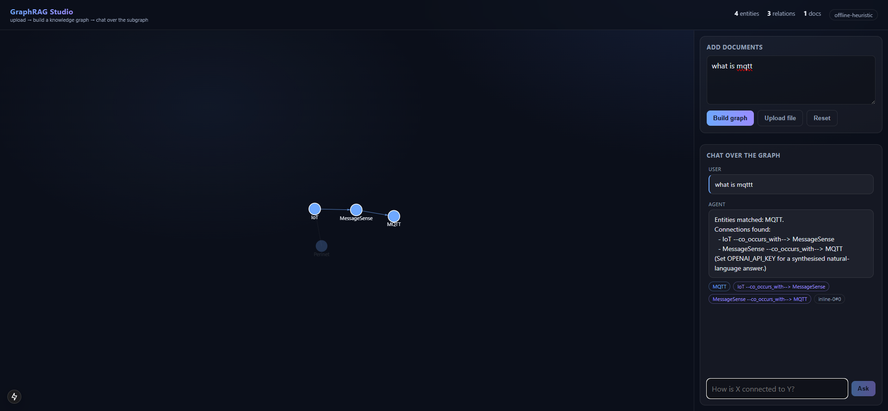
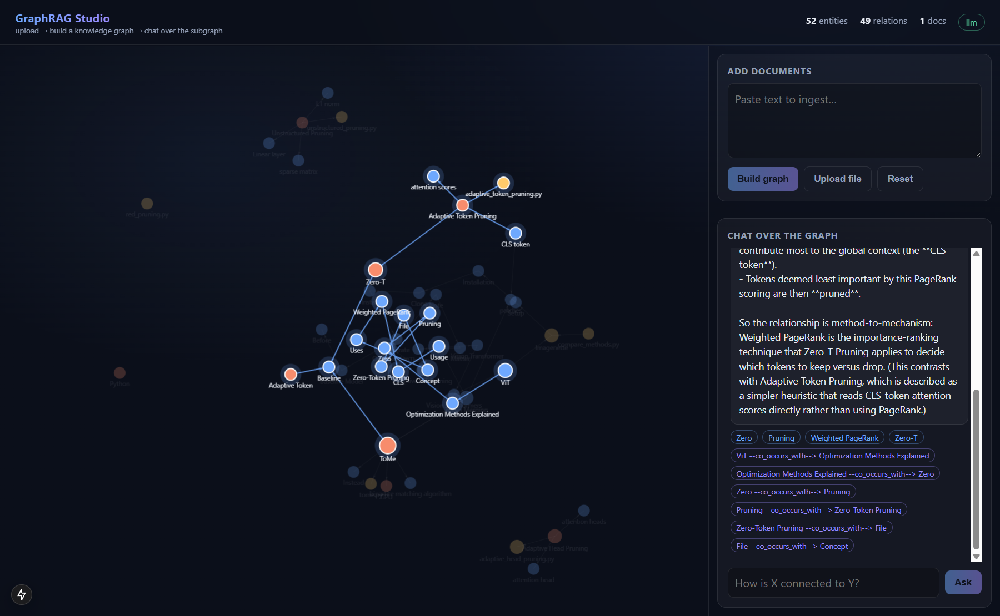

# GraphRAG Studio

A full-stack web app for **GraphRAG**: upload documents, watch a typed **knowledge
graph** build from them, then **chat over k-hop subgraph retrieval** — every answer
highlights the exact subgraph it used and cites the entities, relations and source
chunks behind it.

Plain vector RAG retrieves *passages*. GraphRAG retrieves *structure*, so it can answer
multi-hop questions ("how is X connected to Y?") that flat retrieval misses. This app puts
a visual, interactive face on that idea.

```
 ┌── Next.js + TypeScript frontend ──┐        ┌── FastAPI backend ──┐
 │  force-directed graph view        │  HTTP  │  /api/build  /ask   │
 │  chat panel + citations           │ ─────▶ │  /api/graph  /reset │
 │  document upload                  │        │                     │
 └───────────────────────────────────┘        └──────────┬──────────┘
                                                          │ imports
                                              ┌───────────▼───────────┐
                                              │  graphrag-agent (lib)  │
                                              │  extract → KG → k-hop  │
                                              └────────────────────────┘
```

The graph engine is the separate [`graphrag-agent`](https://github.com/axon011/graphrag-agent)
library — Studio is the application layer on top of it.

## Demo



### On a real corpus — a Master's-thesis repository

Pointed at a thesis repo on efficient Vision Transformer inference and run with a **Claude
subscription (OAuth, no API key)**, Studio extracted **52 entities and 49 relations** from
the project's documentation. Asking a question highlights the retrieved subgraph (below) and
dims the rest:



The payoff is the **multi-hop** question — the kind flat vector RAG struggles with because
the answer is an explicit *relationship*, not a passage:

> **Q:** How is Zero-T Pruning related to Weighted PageRank?
>
> **A:** Zero-T Pruning **uses** Weighted PageRank as its core algorithm. It runs Weighted
> PageRank on a layer's attention matrix to score each token's contribution to the global
> context (the CLS token), then prunes the rest.
>
> _cited edge:_ `Zero-T Pruning --uses--> Weighted PageRank`

The agent linked the question to the `Zero-T Pruning` entity, expanded its k-hop
neighbourhood, and answered from the subgraph — citing the exact relation it traversed.

## Stack

- **Frontend:** Next.js 15 (App Router), TypeScript, React 19, `react-force-graph-2d`
- **Backend:** FastAPI, Pydantic, the `graphrag-agent` Python package
- **LLM:** provider-agnostic via `graphrag-agent` (`GRAPHRAG_LLM=api|codex|claude|gemini|off`).
  Runs end to end offline with the heuristic extractor when no provider is set, and can
  use a **Claude Code / Codex CLI subscription instead of an API key** (see below).

## Run it

### 1. Backend

```bash
cd backend
pip install -r requirements.txt
pip install -e ../../graphrag-agent      # the graph engine (editable)
uvicorn app.main:app --reload --port 8000
```

Optional: seed the graph from an existing build with
`GRAPHRAG_STUDIO_GRAPH=/path/to/kg.json`.

#### LLM provider — no API key required

The backend reads `GRAPHRAG_LLM` to pick how entities/relations are extracted and how
answers are written:

```bash
# Use a Claude Code subscription (OAuth) instead of an API key:
GRAPHRAG_LLM=claude uvicorn app.main:app --reload --port 8000

# Or a Codex CLI subscription:
GRAPHRAG_LLM=codex  uvicorn app.main:app --reload --port 8000

# Or an OpenAI-compatible API key:
OPENAI_API_KEY=sk-... GRAPHRAG_LLM=api uvicorn app.main:app --port 8000

# Or fully offline (heuristic extractor — used by the tests):
GRAPHRAG_LLM=off    uvicorn app.main:app --port 8000
```

The `claude` provider runs `claude -p` with MCP isolation
(`--strict-mcp-config --mcp-config '{"mcpServers":{}}'`) so it returns promptly and is not
slowed by interactive-session hooks.

### 2. Frontend

```bash
cd frontend
cp .env.local.example .env.local         # points at http://localhost:8000
npm install
npm run dev                              # http://localhost:3000
```

Paste text or upload a `.txt`/`.md` file, watch the graph appear, then ask questions.

## API

| Method | Path           | Body                          | Returns                          |
| ------ | -------------- | ----------------------------- | -------------------------------- |
| GET    | `/api/health`  | –                             | graph stats                      |
| GET    | `/api/graph`   | –                             | `{nodes, edges, stats}`          |
| POST   | `/api/build`   | `{text, source?, reset?}`     | updated graph                    |
| POST   | `/api/upload`  | multipart `file` (`?reset=`)  | updated graph                    |
| POST   | `/api/ask`     | `{question}`                  | `{answer, citations, triples, subgraph_node_ids}` |
| POST   | `/api/reset`   | –                             | empty graph                      |

## Tests

```bash
cd backend && pytest -q                  # offline, no API key needed
```

## License

MIT
